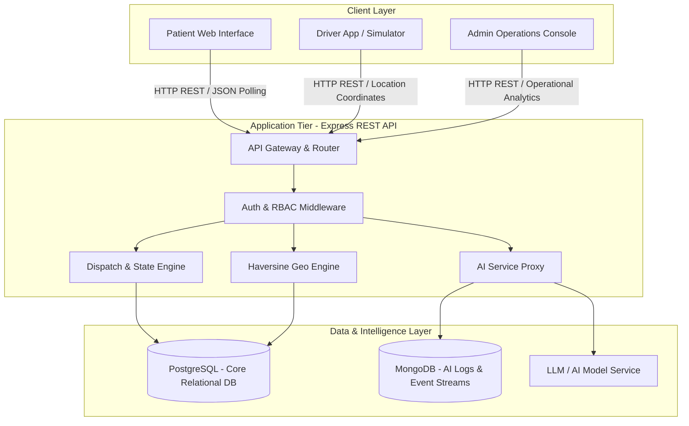
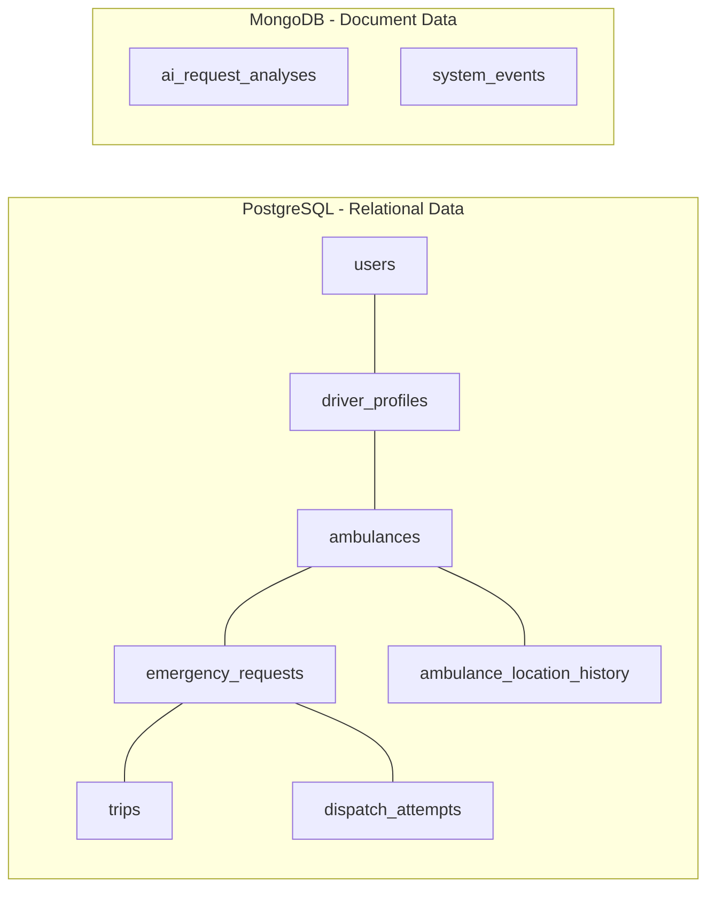
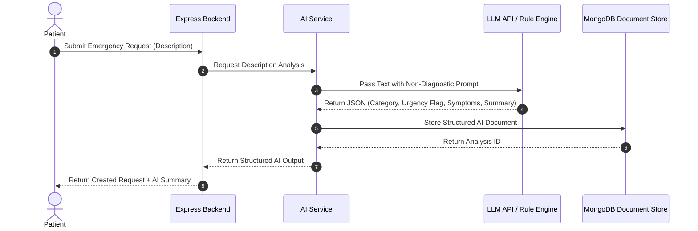
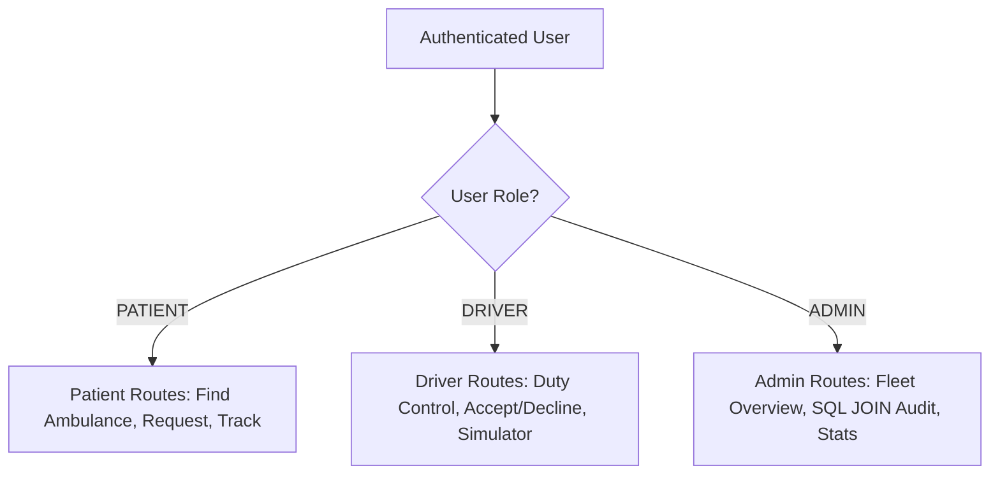
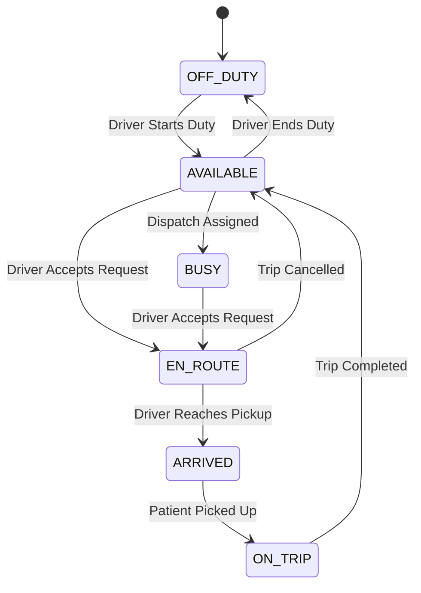
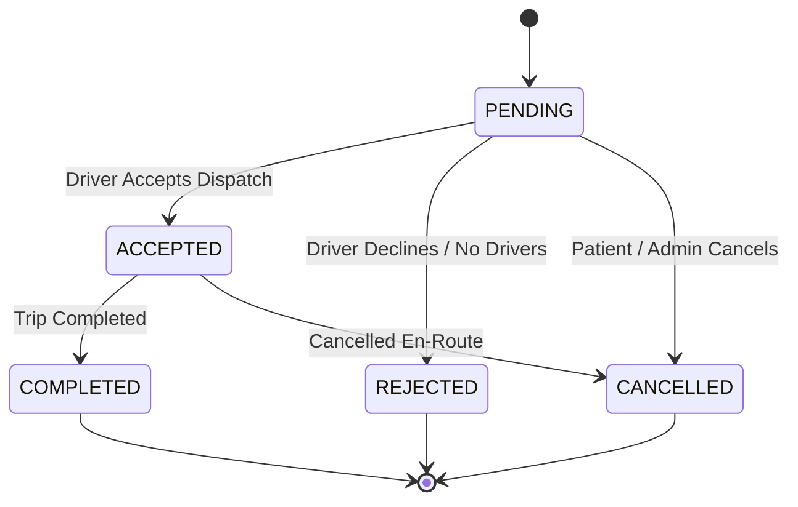
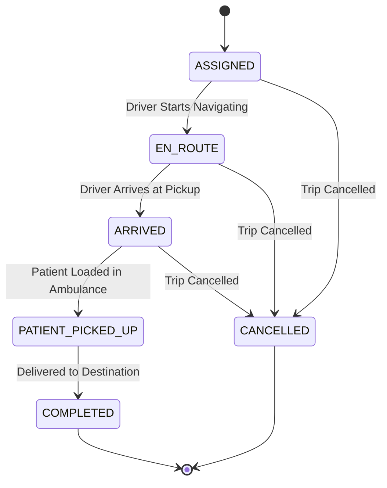
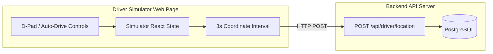

# ResQLink — High-Level Design (HLD)

---

## 1. Document Overview

This document presents the **High-Level Design (HLD)** for **ResQLink**, an AI-powered real-time ambulance availability, dispatch, and tracking platform. ResQLink connects emergency patients, ambulance drivers, and regional fleet administrators into a unified healthcare response ecosystem.

This document details the system architecture, major components, database role allocation, integration strategies, core workflows, lifecycle state machines, security model, scalability considerations, and future roadmap.

---

## 2. Project Title & Overview

- **Project Title**: ResQLink — AI-Powered Real-Time Ambulance Availability, Dispatch & Tracking Platform
- **Domain**: Emergency Healthcare Technology / Fleet Telematics
- **Core Mission**: Reduce emergency medical response delays by providing transparent ambulance availability, intelligent proximity-based dispatching, structured AI emergency descriptions, and live telemetry tracking.

---

## 3. Problem Statement

Emergency response systems worldwide face critical challenges:
1. **Lack of Real-Time Availability Transparency**: Patients and call centers often struggle to identify available emergency vehicles in nearby geographical proximity.
2. **Manual & Uncoordinated Dispatching**: Manual phone coordination causes lost minutes during critical emergency windows.
3. **Unstructured Emergency Context**: First responders frequently receive vague emergency reports without categorized urgency indicators.
4. **Lack of Live Telemetry Tracking**: Patients experience severe anxiety and uncertainty due to the absence of continuous ambulance location updates.
5. **Double-Assignment Race Conditions**: Concurrent dispatch requests can lead to double booking the same ambulance.

---

## 4. Goals and Objectives

- **Sub-Minute Dispatch Triggering**: Enable patients to discover nearby ambulances and trigger dispatch requests instantly.
- **Proximity-Based Discovery**: Utilize Haversine geographic calculation to identify eligible on-duty ambulances within a configurable radius (e.g., 50 km).
- **Non-Diagnostic AI Text Structuring**: Convert patient emergency descriptions into structured urgency flags (`CRITICAL`, `HIGH`, `MEDIUM`, `LOW`) for dispatcher and responder preparation.
- **Concurrency Protection**: Enforce atomic database transactions to eliminate double-assignment race conditions.
- **Role-Based Command & Control**: Provide tailored web interfaces for Patients, Ambulance Drivers, and Fleet Administrators.
- **Live Location Telemetry**: Stream location updates to patient tracking interfaces with smooth position rendering.

---

## 5. System Overview & Architecture

ResQLink follows a modern full-stack decoupled web architecture:

- **Frontend Tier**: Single-Page Application (SPA) built with React and Vite, rendered with light-theme healthcare UI components, Leaflet map overlays, and Web Audio API alerts.
- **Backend Tier**: Node.js and Express RESTful API server handling business logic, authentication, RBAC, state machine transitions, and concurrency safety.
- **Data & AI Tier**:
  - **PostgreSQL**: Primary relational database maintaining core entity data, relational integrity, state constraints, and audit trails.
  - **MongoDB**: Schema-agnostic document database storing AI structured analyses, system logs, and event streams.
  - **LLM/AI Engine**: Server-side artificial intelligence service extracting logistical insights from free-text emergency descriptions.

### Overall System Architecture Diagram



---

## 6. Major System Components

### 6.1 Frontend Architecture
- **Framework**: React 18, Vite.
- **Routing**: React Router DOM (v6) with role-protected route guards (`ProtectedRoute`).
- **State Management**: React Context (`AuthContext`) for user session persistence.
- **Mapping**: Leaflet API & OpenStreetMap tiles rendered via `AmbulanceTrackingMap.jsx`.
- **Live Updates**: High-efficiency client polling via custom `usePolling` hook (`POLL_INTERVAL_MS=3000`).

### 6.2 Backend Architecture
- **Runtime & Framework**: Node.js, Express.js.
- **Layered Structure**: Controller-Service-Model architecture cleanly decoupling HTTP parsing, domain business logic, and database persistence.
- **State Machines**: Formal state transition maps enforcing valid status movements for Ambulances, Emergency Requests, and Trips.
- **Security & Middleware**: Rate-limiting closures, Bearer JWT verification, role authorization, and centralized error handling.

### 6.3 Database Architecture & Division of Roles
ResQLink utilizes a **polyglot persistence** approach:



#### PostgreSQL Role (Relational Data & Concurrency Control)
- Stores core relational entities: `users`, `driver_profiles`, `ambulances`, `emergency_requests`, `trips`, `ambulance_location_history`, and `dispatch_attempts`.
- Guarantees ACID compliance, foreign key integrity, coordinate range checks, status check constraints, and partial unique indexes for single active trip enforcement.
- Provides atomic transaction locks (`FOR UPDATE`) for race-condition prevention during request acceptance.

#### MongoDB Role (Flexible Document Data & Analytics)
- Stores structured AI text analysis documents (`ai_request_analyses`).
- Records real-time system audit logs and event streams (`system_events`).
- Enables schema flexibility for evolving AI metadata without requiring relational database migration changes.

---

## 7. AI / LLM Integration Architecture

ResQLink incorporates artificial intelligence to structure free-text patient emergency descriptions into logistical indicators.



### AI Safety & Non-Diagnostic Mandates
- **Strictly Non-Diagnostic**: AI explicitly does NOT diagnose illnesses or prescribe treatments.
- **Logistical Focus**: AI extracts symptoms, estimates category (`cardiac_respiratory`, `trauma_accident`, etc.), assigns urgency flags (`CRITICAL`, `HIGH`, `MEDIUM`, `LOW`), and generates dispatcher summaries.
- **Graceful Degradation**: If the AI model API is unavailable or rate-limited, the system falls back to a deterministic heuristic rule engine (`fallbackRuleAnalysis`) without blocking emergency request creation in PostgreSQL.

---

## 8. Maps & Location Tracking Architecture

- **Map Engine**: Leaflet open-source mapping library with OpenStreetMap tile layer.
- **Coordinate Handling**: Standard WGS-84 latitude and longitude coordinates.
- **Interpolation Engine**: Client-side linear interpolation (lerp) smoothly animates ambulance marker movements between 3-second polling updates.
- **Location History**: Every location update received from a driver app or simulator is stored in PostgreSQL `ambulance_location_history` for route analysis and auditing.

---

## 9. Authentication & Role-Based Access Control (RBAC)

ResQLink enforces role-based access control across three user roles:



- **Authentication**: Stateless JSON Web Tokens (JWT) signed with HMAC SHA-256 and sent via HTTP `Authorization: Bearer <token>` headers.
- **Password Security**: Passwords hashed using Bcryptjs with 10 salt rounds.
- **Anonymous Emergency Requests**: Unauthenticated patients can submit emergency requests and receive a secure 32-character hexadecimal tracking token (`tracking_token`) to view and track their request.

---

## 10. Major User Workflows

### 10.1 Patient Workflow
1. Patient navigates to emergency request portal.
2. Patient grants geolocation or inputs pickup location coordinates.
3. Patient provides emergency text description.
4. System queries nearby available ambulances, calculates Haversine distances & ETAs, and triggers AI text structuring.
5. Patient submits request and tracks ambulance arrival on a live map.

### 10.2 Driver Workflow
1. Driver logs in and toggles duty state to `ON_DUTY` (updating status to `AVAILABLE`).
2. Driver receives incoming dispatch alert (accompanied by Web Audio alert tone).
3. Driver accepts or declines emergency dispatch request.
4. Upon acceptance, driver progresses trip state: `EN_ROUTE` → `ARRIVED` → `PATIENT_PICKED_UP` → `COMPLETED`.
5. Upon completion, driver availability status automatically resets to `AVAILABLE`.

### 10.3 Admin Workflow
1. Admin logs into the Operations Console.
2. Admin monitors regional fleet availability, active request lists, and fleet statistics.
3. Admin views active trip logs compiled via a **5-table SQL JOIN query**.
4. Admin can manually update ambulance status or review system audit events.

---

## 11. Core Lifecycle State Machines

### 11.1 Ambulance Status Lifecycle



### 11.2 Emergency Request Lifecycle



### 11.3 Trip Lifecycle



---

## 12. Dispatch & Auto Search Workflows

### 12.1 Proximity Discovery & Haversine Distance
The system calculates distance between patient pickup coordinates $(lat_1, lon_1)$ and ambulance coordinates $(lat_2, lon_2)$ using the **Haversine formula**:

$$\Delta lat = lat_2 - lat_1, \quad \Delta lon = lon_2 - lon_1$$
$$a = \sin^2\left(\frac{\Delta lat}{2}\right) + \cos(lat_1) \cdot \cos(lat_2) \cdot \sin^2\left(\frac{\Delta lon}{2}\right)$$
$$c = 2 \cdot \text{atan2}(\sqrt{a}, \sqrt{1-a})$$
$$d = R \cdot c \quad (R = 6371 \text{ km})$$

ETA is computed using a constant average speed parameter ($40 \text{ km/h}$):
$$\text{ETA (minutes)} = \left\lceil \frac{d}{40} \times 60 \right\rceil$$

### 12.2 Auto Search Logic
When Auto Search is invoked (`POST /api/emergency-requests/:id/auto-assign`):
1. The engine checks if the request is in `PENDING` state.
2. It fetches all `AVAILABLE` ambulances, filtering out any driver/ambulance that has already recorded a `DECLINED` attempt in `dispatch_attempts`.
3. It computes Haversine distances to all remaining candidate ambulances.
4. It selects the nearest eligible ambulance and assigns it to the emergency request.

---

## 13. Driver Simulator Architecture

The **Driver Simulator** is a dedicated development and demonstration component operating on standard backend REST APIs:



- **API Compliance**: Uses real authentication and calls `POST /api/driver/location` to simulate physical hardware.
- **Auto-Drive Mode**: Computes step-by-step vector increments towards target coordinates every 3 seconds.
- **Audio Feedback**: Uses Web Audio API synthesizers to emit acoustic siren alerts when new requests arrive.

---

## 14. Security, Concurrency & Scalability Considerations

### 14.1 Concurrency Protection
To prevent double assignment when multiple drivers attempt to accept the same pending request simultaneously, the system uses PostgreSQL atomic transactions with `FOR UPDATE` row locking:

```sql
BEGIN;
SELECT id, request_status FROM emergency_requests WHERE id = $1 FOR UPDATE;
-- Check status === 'PENDING' (Throw 409 Conflict if taken)
SELECT id, status FROM ambulances WHERE id = $2 FOR UPDATE;
-- Update request status, ambulance status, driver status, and insert trip record
COMMIT;
```

### 14.2 Security Controls
- **Stateless Authorization**: JWT Bearer verification on protected routes.
- **Role Enforcement**: Strict role-checking middleware preventing Patients from accessing Driver/Admin routes.
- **Rate Limiting**: Custom closure-based rate limiter capping AI analysis calls (e.g., 15 requests per minute per IP).

### 14.3 Current Prototype Limitations & Scalability Roadmap
- **Communication Protocol**: Current prototype relies on HTTP REST polling (`POLL_INTERVAL_MS=3000`). Future production versions will implement WebSockets (Socket.io) or Server-Sent Events (SSE) for server-to-client push updates.
- **Routing Engine**: Distance and ETA currently use straight-line Haversine math and average speed assumptions ($40 \text{ km/h}$). Production will integrate OpenStreetMap/OSRM or Google Maps API for real-time traffic routing.
- **Mobile Hardware**: The Driver Simulator currently mimics mobile hardware; production deployment will package the driver workflow into native Android/iOS mobile apps using device GPS sensors.
