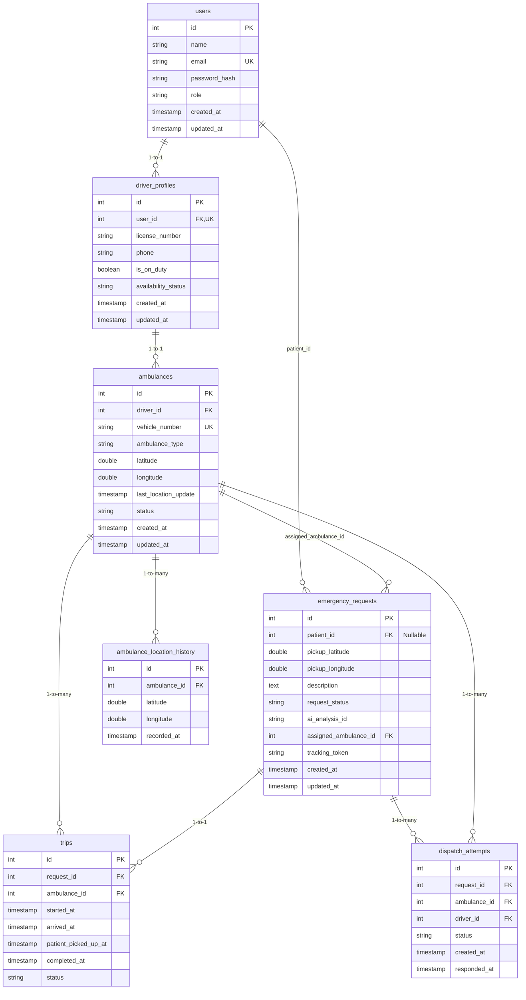
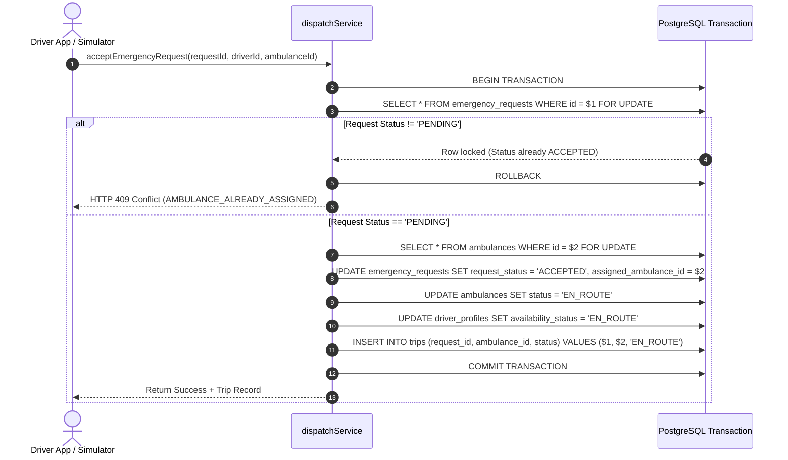

# ResQLink — Low-Level Design (LLD)

---

## 1. Document Overview

This document specifies the **Low-Level Design (LLD)** for **ResQLink**, accurately reflecting the **actual implementation** of the codebase across the backend API, database schema, state machine engines, services, controllers, middleware, frontend components, and test framework.

---

## 2. Directory Structure & File Map

### 2.1 Backend Directory Architecture (`backend/`)

```
backend/
├── package.json
├── __tests__/
│   ├── ai.test.js
│   ├── stateMachine.test.js
│   └── workflow.test.js
└── src/
    ├── app.js
    ├── server.js
    ├── config/
    │   └── env.js
    ├── controllers/
    │   ├── adminController.js
    │   ├── authController.js
    │   ├── driverController.js
    │   └── patientController.js
    ├── db/
    │   ├── mongodb.js
    │   ├── postgres.js
    │   └── seed.js
    ├── middleware/
    │   ├── authMiddleware.js
    │   ├── errorMiddleware.js
    │   ├── loggerMiddleware.js
    │   ├── roleMiddleware.js
    │   └── validatorMiddleware.js
    ├── models/
    │   ├── aiAnalysisModel.js
    │   └── systemEventModel.js
    ├── routes/
    │   ├── adminRoutes.js
    │   ├── authRoutes.js
    │   ├── driverRoutes.js
    │   └── patientRoutes.js
    ├── services/
    │   ├── aiService.js
    │   ├── ambulanceService.js
    │   ├── authService.js
    │   └── dispatchService.js
    └── utils/
        ├── closureHelpers.js
        └── haversine.js
```

### 2.2 Frontend Directory Architecture (`frontend/`)

```
frontend/
├── index.html
├── package.json
├── vite.config.js
└── src/
    ├── App.jsx
    ├── main.jsx
    ├── index.css
    ├── components/
    │   ├── common/
    │   │   └── Logo.jsx
    │   ├── layout/
    │   │   └── Navbar.jsx
    │   └── map/
    │       └── AmbulanceTrackingMap.jsx
    ├── context/
    │   └── AuthContext.jsx
    ├── hooks/
    │   └── usePolling.js
    ├── pages/
    │   ├── AdminDashboard.jsx
    │   ├── DriverCurrentBookingPage.jsx
    │   ├── DriverSimulatorPage.jsx
    │   ├── DriverTripHistoryPage.jsx
    │   ├── FindAmbulancePage.jsx
    │   ├── LandingPage.jsx
    │   ├── LoginPage.jsx
    │   ├── PatientBookingHistoryPage.jsx
    │   ├── PatientCurrentBookingPage.jsx
    │   ├── PatientDashboard.jsx
    │   ├── RegisterPage.jsx
    │   └── RequestTrackingPage.jsx
    └── services/
        └── api.js
```

---

## 3. Database Schema & Low-Level Specifications

### 3.1 Entity-Relationship (ER) Diagram



### 3.2 Database Table Specifications & Constraints

#### 1. `users`
- Primary Key: `id` (SERIAL).
- Unique Index: `email` (VARCHAR 255).
- Constraint: `CHECK (role IN ('PATIENT', 'DRIVER', 'ADMIN'))`.

#### 2. `driver_profiles`
- Primary Key: `id` (SERIAL).
- Foreign Key: `user_id` -> `users(id)` ON DELETE CASCADE.
- Constraint: `UNIQUE (user_id)` (Migration 002).

#### 3. `ambulances`
- Primary Key: `id` (SERIAL).
- Foreign Key: `driver_id` -> `driver_profiles(id)` ON DELETE SET NULL.
- Constraints:
  - `CHECK (latitude BETWEEN -90 AND 90)`
  - `CHECK (longitude BETWEEN -180 AND 180)`
  - `CHECK (status IN ('OFF_DUTY', 'AVAILABLE', 'BUSY', 'EN_ROUTE', 'ARRIVED', 'ON_TRIP'))`

#### 4. `emergency_requests`
- Primary Key: `id` (SERIAL).
- Foreign Key: `patient_id` -> `users(id)` ON DELETE CASCADE (Nullable for anonymous requests per Migration 003).
- Foreign Key: `assigned_ambulance_id` -> `ambulances(id)` ON DELETE SET NULL.
- Constraints:
  - `CHECK (pickup_latitude BETWEEN -90 AND 90)`
  - `CHECK (pickup_longitude BETWEEN -180 AND 180)`
  - `CHECK (request_status IN ('PENDING', 'ACCEPTED', 'REJECTED', 'CANCELLED', 'COMPLETED'))`

#### 5. `trips`
- Primary Key: `id` (SERIAL).
- Foreign Keys: `request_id` -> `emergency_requests(id)`, `ambulance_id` -> `ambulances(id)`.
- Partial Unique Index:
  ```sql
  CREATE UNIQUE INDEX idx_unique_active_trip_per_ambulance 
  ON trips(ambulance_id) 
  WHERE status IN ('ASSIGNED', 'EN_ROUTE', 'ARRIVED', 'PATIENT_PICKED_UP');
  ```
  *(Prevents an ambulance from simultaneously holding multiple active trips).*

#### 6. `dispatch_attempts` (Migration 004)
- Tracks individual dispatch offers and decline actions (`OFFERED`, `DECLINED`, `ACCEPTED`, `EXPIRED`).

---

## 4. API Endpoints & Specifications

### 4.1 Authentication Endpoints (`/api/auth`)

| Endpoint | Method | Middleware | Description |
| :--- | :--- | :--- | :--- |
| `/api/auth/register` | `POST` | `validatorMiddleware` | Register user (`PATIENT` or `DRIVER`). Generates JWT token. |
| `/api/auth/login` | `POST` | `validatorMiddleware` | Authenticate email/password. Returns JWT token. |
| `/api/auth/logout` | `POST` | None | Client session cleanup. |
| `/api/auth/me` | `GET` | `authMiddleware` | Fetch current user profile with driver/ambulance info. |

### 4.2 Patient & Emergency Request Endpoints (`/api`)

| Endpoint | Method | Auth | Description |
| :--- | :--- | :--- | :--- |
| `/api/ambulances/nearby` | `GET` | Optional | Proximity query: returns AVAILABLE ambulances sorted by Haversine distance with ETA. |
| `/api/emergency-requests` | `POST` | Optional | Submit emergency request, triggers AI text analysis, returns request & analysis object. |
| `/api/emergency-requests` | `GET` | `authMiddleware` | Get patient's emergency request history. |
| `/api/emergency-requests/:id` | `GET` | Token/Auth | Get single request details by ID or tracking token. |
| `/api/emergency-requests/:id/cancel` | `PATCH` | Token/Auth | Cancel emergency request and free assigned ambulance. |
| `/api/emergency-requests/:id/auto-assign` | `POST` | Optional | Automatically search and assign nearest non-declined available ambulance. |

### 4.3 Driver Endpoints (`/api/driver`)

| Endpoint | Method | Auth Guard | Description |
| :--- | :--- | :--- | :--- |
| `/api/driver/duty/start` | `POST` | `authMiddleware`, `roleMiddleware(['DRIVER'])` | Toggle duty state to ON_DUTY, status to AVAILABLE. |
| `/api/driver/duty/end` | `POST` | `authMiddleware`, `roleMiddleware(['DRIVER'])` | Toggle duty state to OFF_DUTY, status to OFF_DUTY. |
| `/api/driver/status` | `PATCH` | `authMiddleware`, `roleMiddleware(['DRIVER'])` | Update driver/ambulance status with validation. |
| `/api/driver/location` | `POST` | `authMiddleware`, `roleMiddleware(['DRIVER'])` | Post GPS coordinates & append location history. |
| `/api/driver/requests` | `GET` | `authMiddleware`, `roleMiddleware(['DRIVER'])` | Fetch pending dispatch requests (excluding declined). |
| `/api/driver/requests/:id/accept` | `POST` | `authMiddleware`, `roleMiddleware(['DRIVER'])` | Accept dispatch atomically with FOR UPDATE locks. |
| `/api/driver/requests/:id/reject` | `POST` | `authMiddleware`, `roleMiddleware(['DRIVER'])` | Decline request & record attempt in `dispatch_attempts`. |
| `/api/driver/trips/:id/start` | `POST` | `authMiddleware`, `roleMiddleware(['DRIVER'])` | Start trip -> status `EN_ROUTE`. |
| `/api/driver/trips/:id/arrived` | `POST` | `authMiddleware`, `roleMiddleware(['DRIVER'])` | Mark arrival -> status `ARRIVED`. |
| `/api/driver/trips/:id/patient-picked-up` | `POST` | `authMiddleware`, `roleMiddleware(['DRIVER'])` | Mark patient loaded -> status `PATIENT_PICKED_UP`. |
| `/api/driver/trips/:id/complete` | `POST` | `authMiddleware`, `roleMiddleware(['DRIVER'])` | Complete trip -> reset ambulance to `AVAILABLE`. |
| `/api/driver/trips` | `GET` | `authMiddleware`, `roleMiddleware(['DRIVER'])` | Get trip history for driver. |

### 4.4 Admin Endpoints (`/api/admin`)

| Endpoint | Method | Auth Guard | Description |
| :--- | :--- | :--- | :--- |
| `/api/admin/ambulances` | `GET` | `authMiddleware`, `roleMiddleware(['ADMIN'])` | List full fleet listing with driver links. |
| `/api/admin/requests` | `GET` | `authMiddleware`, `roleMiddleware(['ADMIN'])` | List all emergency requests. |
| `/api/admin/trips` | `GET` | `authMiddleware`, `roleMiddleware(['ADMIN'])` | Audit active/past trips via 5-table SQL JOIN. |
| `/api/admin/statistics` | `GET` | `authMiddleware`, `roleMiddleware(['ADMIN'])` | Operational stats summary. |
| `/api/admin/locations` | `GET` | `authMiddleware`, `roleMiddleware(['ADMIN'])` | Real-time map coordinates of all fleet units. |
| `/api/admin/events` | `GET` | `authMiddleware`, `roleMiddleware(['ADMIN'])` | In-memory MongoDB system event audit stream. |
| `/api/admin/ambulances/:id/status` | `PATCH` | `authMiddleware`, `roleMiddleware(['ADMIN'])` | Admin override of ambulance status. |

---

## 5. Core Services & Domain Logic

### 5.1 `dispatchService.js` — State Machines & Concurrency Control

#### State Transition Logic (`validateStatusTransition`)
- **Ambulance States**:
  - `OFF_DUTY` → `AVAILABLE`
  - `AVAILABLE` → `BUSY`, `OFF_DUTY`
  - `BUSY` → `EN_ROUTE`, `AVAILABLE`
  - `EN_ROUTE` → `ARRIVED`, `CANCELLED`
  - `ARRIVED` → `ON_TRIP`, `CANCELLED`
  - `ON_TRIP` → `AVAILABLE`, `CANCELLED`
- **Request States**:
  - `PENDING` → `ACCEPTED`, `REJECTED`, `CANCELLED`
  - `ACCEPTED` → `COMPLETED`, `CANCELLED`
- **Trip States**:
  - `ASSIGNED` → `EN_ROUTE`, `CANCELLED`
  - `EN_ROUTE` → `ARRIVED`, `CANCELLED`
  - `ARRIVED` → `PATIENT_PICKED_UP`, `CANCELLED`
  - `PATIENT_PICKED_UP` → `COMPLETED`, `CANCELLED`

#### Concurrency & Double-Assignment Protection (`acceptEmergencyRequest`)



### 5.2 `ambulanceService.js` & `haversine.js` — Distance & ETA Algorithm

The `calculateHaversineDistance` function computes the great-circle distance:

```javascript
function calculateHaversineDistance(lat1, lon1, lat2, lon2) {
  const R = 6371; // Earth's mean radius in km
  const dLat = toRad(lat2 - lat1);
  const dLon = toRad(lon2 - lon1);
  const a = Math.sin(dLat / 2) * Math.sin(dLat / 2) +
            Math.cos(toRad(lat1)) * Math.cos(toRad(lat2)) *
            Math.sin(dLon / 2) * Math.sin(dLon / 2);
  const c = 2 * Math.atan2(Math.sqrt(a), Math.sqrt(1 - a));
  return Math.round(R * c * 100) / 100;
}
```

ETA Calculation (`calculateETA`):
```javascript
function calculateETA(distanceKm) {
  const speed = config.averageAmbulanceSpeedKmh || 40; // 40 km/h
  const minutes = Math.ceil((distanceKm / speed) * 60);
  return Math.max(minutes, 1);
}
```

---

## 6. Frontend Components & Implementation

### 6.1 Routing & Guards (`App.jsx`)
- `ProtectedRoute`: Evaluates `user` object and `allowedRoles` array. Unauthenticated users are redirected to `/login`; unauthorized roles are redirected to their designated dashboard (`/driver`, `/admin`, or `/dashboard`).

### 6.2 Driver Simulator Component (`DriverSimulatorPage.jsx`)
- **State Properties**: `isOnDuty`, `status`, `location`, `autoMove`, `incomingRequests`, `activeTrip`.
- **Location Polling & Auto-Drive**: Every 3 seconds during Auto-Drive mode, updates coordinates towards target and posts via `api.updateDriverLocation(lat, lon, ambId)`.
- **Web Audio Siren Alert**: Plays dual-tone acoustic synthesizer sound via Web Audio API whenever a new incoming dispatch arrives.

### 6.3 Live Map Component (`AmbulanceTrackingMap.jsx`)
- Built on `react-leaflet` (`MapContainer`, `TileLayer`, `Marker`, `Popup`).
- **Linear Interpolation (Lerp)**: Smoothly animates ambulance markers over polling intervals:
  $$\text{lat}_{\text{current}} = \text{lat}_{\text{old}} + (\text{lat}_{\text{target}} - \text{lat}_{\text{old}}) \times t$$

---

## 7. Testing Architecture

The backend includes a comprehensive Jest test suite:
- `backend/__tests__/stateMachine.test.js`: Verifies state transition rules for ambulances, requests, and trips.
- `backend/__tests__/ai.test.js`: Tests AI text analysis, fallback rule extraction, and safety prompt compliance.
- `backend/__tests__/workflow.test.js`: End-to-end REST API integration tests covering registration, login, request creation, driver duty toggling, dispatch acceptance, location updates, and trip completion.

---

## 8. 5-Table SQL JOIN Query (Admin Audit Log)

The Admin Console executes a 5-table relational JOIN query in `adminController.js`:

```sql
SELECT t.id as trip_id, t.status as trip_status, t.started_at, t.arrived_at, t.patient_picked_up_at, t.completed_at,
       a.vehicle_number, a.ambulance_type,
       d.license_number, d.phone as driver_phone,
       du.name as driver_name,
       pu.name as patient_name, pu.email as patient_email,
       r.description as emergency_description, r.pickup_latitude, r.pickup_longitude
FROM trips t
INNER JOIN ambulances a ON t.ambulance_id = a.id
LEFT JOIN driver_profiles d ON a.driver_id = d.id
LEFT JOIN users du ON d.user_id = du.id
INNER JOIN emergency_requests r ON t.request_id = r.id
INNER JOIN users pu ON r.patient_id = pu.id
ORDER BY t.started_at DESC;
```
