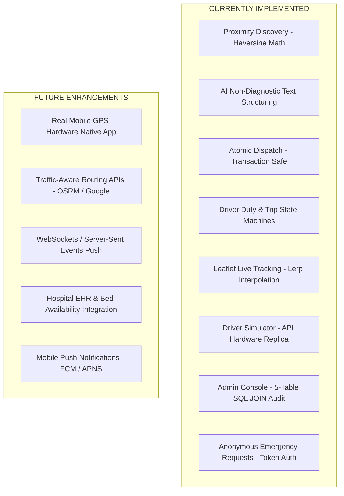

# ResQLink — Product Requirements Document (PRD)

---

## 1. Document Overview

This Product Requirements Document (PRD) defines the product vision, target user personas, functional specifications, non-functional requirements, scope boundaries, acceptance criteria, and success metrics for **ResQLink** (AI-Powered Real-Time Ambulance Availability, Dispatch & Tracking Platform).

> [!IMPORTANT]
> This document explicitly distinguishes between **CURRENTLY IMPLEMENTED** features and **FUTURE ENHANCEMENTS / ROADMAP**. Unimplemented capabilities (such as physical mobile GPS hardware integration, traffic-aware routing, push notifications, and hospital software integration) are strictly documented as Future Scope.

---

## 2. Product Vision & Problem Statement

### 2.1 Product Vision
ResQLink aims to eliminate emergency medical response delays by building a transparent, real-time ambulance availability network. By combining proximity-based discovery, atomic dispatch transactions, AI emergency description structuring, and live telemetry tracking, ResQLink empowers patients, emergency drivers, and fleet managers with immediate coordination capabilities.

### 2.2 Problem Statement
- **Patient Anxiety & Blind Spots**: Patients in emergency situations lack visibility into nearby available ambulances and live vehicle arrival ETAs.
- **Dispatch Inefficiencies**: Traditional phone dispatch causes critical delay windows during medical emergencies.
- **Unstructured Emergency Data**: Dispatchers and responders receive unstructured reports without standardized urgency categorization.
- **Double-Assignment Risks**: Concurrent dispatch requests without transaction protection risk assigning multiple drivers or double-booking vehicles.

---

## 3. Target Users & User Personas

### 3.1 Persona 1: Emergency Patient / Bystander ("Rahul")
- **Role**: `PATIENT` (or Unauthenticated Anonymous Dispatcher).
- **Need**: Rapidly find an available ambulance nearby, describe the emergency in plain text, submit a dispatch request, and visually track vehicle arrival in real time.
- **Key Pain Point**: Uncertainty about ambulance location and arrival time.

### 3.2 Persona 2: Ambulance Driver ("Rajesh")
- **Role**: `DRIVER`.
- **Need**: Simple mobile-friendly interface to start/end duty, receive immediate acoustic and visual dispatch alerts, accept/decline dispatches, update trip status (`EN_ROUTE`, `ARRIVED`, `PATIENT_PICKED_UP`, `COMPLETED`), and broadcast location coordinates.
- **Key Pain Point**: Complicated dispatch software and missed notifications while driving.

### 3.3 Persona 3: Regional Fleet Administrator ("Dr. Sharma")
- **Role**: `ADMIN`.
- **Need**: Operational dashboard summarizing total fleet status (Available, En-Route, Off-Duty), active emergency requests, complete trip audit trails with full driver/patient metadata, and system logs.
- **Key Pain Point**: Fragmented reporting and inability to audit past emergency trips.

---

## 4. Feature Classification: Current Implementation vs. Future Scope

---

## 5. Detailed Functional Requirements

### 5.1 Ambulance Discovery & Proximity Requirements

| ID | Requirement Name | Description | Status |
| :--- | :--- | :--- | :--- |
| **FR-AMB-01** | Proximity Search | Query `AVAILABLE` ambulances within a configurable radius (default 50 km) based on patient coordinates. | **CURRENTLY IMPLEMENTED** |
| **FR-AMB-02** | Haversine Distance | Compute geographical distance using the Haversine formula rounded to 2 decimal places. | **CURRENTLY IMPLEMENTED** |
| **FR-AMB-03** | Estimated ETA | Calculate estimated arrival time in minutes based on distance and average speed ($40 \text{ km/h}$). | **CURRENTLY IMPLEMENTED** |
| **FR-AMB-04** | Traffic-Aware ETA | Compute ETAs dynamically using real-time traffic congestion data. | **FUTURE ENHANCEMENT** |

### 5.2 Emergency Request & AI Requirements

| ID | Requirement Name | Description | Status |
| :--- | :--- | :--- | :--- |
| **FR-REQ-01** | Request Submission | Allow patients (authenticated or anonymous) to submit pickup coordinates and free-text emergency descriptions. | **CURRENTLY IMPLEMENTED** |
| **FR-REQ-02** | AI Text Structuring | Process emergency descriptions via AI service to extract category (`cardiac_respiratory`, `trauma_accident`, etc.), urgency flag (`CRITICAL`, `HIGH`, `MEDIUM`, `LOW`), reported symptoms, and brief summary. | **CURRENTLY IMPLEMENTED** |
| **FR-REQ-03** | Non-Diagnostic Mandate | AI prompts and outputs must strictly avoid medical diagnosis, prescription, or clinical decision-making. | **CURRENTLY IMPLEMENTED** |
| **FR-REQ-04** | Graceful AI Fallback | Use rule-based heuristic extraction if AI model API is unreachable, without blocking PostgreSQL request creation. | **CURRENTLY IMPLEMENTED** |
| **FR-REQ-05** | Tracking Token | Issue a secure 32-character hexadecimal token for unauthenticated patients to track request status. | **CURRENTLY IMPLEMENTED** |

### 5.3 Dispatch & Auto Search Requirements

| ID | Requirement Name | Description | Status |
| :--- | :--- | :--- | :--- |
| **FR-DSP-01** | Transaction-Safe Acceptance | Execute dispatch acceptance within a PostgreSQL atomic transaction using `FOR UPDATE` row locks to prevent double-assignment race conditions (return `409 Conflict` if assigned). | **CURRENTLY IMPLEMENTED** |
| **FR-DSP-02** | Auto Search | Automatically identify and assign the nearest eligible available ambulance that has not previously declined the request. | **CURRENTLY IMPLEMENTED** |
| **FR-DSP-03** | Decline Tracking | Record declined dispatch attempts in `dispatch_attempts` table to prevent re-offering to the same driver. | **CURRENTLY IMPLEMENTED** |
| **FR-DSP-04** | Automated Push Notifications | Send native push notifications to driver mobile devices when a request is dispatched. | **FUTURE ENHANCEMENT** |

### 5.4 Driver & Simulator Requirements

| ID | Requirement Name | Description | Status |
| :--- | :--- | :--- | :--- |
| **FR-DRV-01** | Duty Control | Toggle driver availability between `ON_DUTY` (`AVAILABLE`) and `OFF_DUTY`. | **CURRENTLY IMPLEMENTED** |
| **FR-DRV-02** | Trip State Progression | Advance active trip through state machine steps: `EN_ROUTE` → `ARRIVED` → `PATIENT_PICKED_UP` → `COMPLETED`. | **CURRENTLY IMPLEMENTED** |
| **FR-DRV-03** | Automatic Availability Reset | Reset ambulance and driver status to `AVAILABLE` upon trip completion. | **CURRENTLY IMPLEMENTED** |
| **FR-DRV-04** | Driver Simulator | Web-based simulator operating on standard backend REST APIs (`POST /api/driver/location`), supporting manual D-Pad step movement and 3-second auto-drive coordinate loops. | **CURRENTLY IMPLEMENTED** |
| **FR-DRV-05** | Web Audio Emergency Alert | Synthesize dual-tone acoustic emergency alert tones using Web Audio API when new dispatches arrive. | **CURRENTLY IMPLEMENTED** |

### 5.5 Admin Operations Requirements

| ID | Requirement Name | Description | Status |
| :--- | :--- | :--- | :--- |
| **FR-ADM-01** | Fleet Overview | Display comprehensive list of all registered ambulances, duty statuses, vehicle types, and linked drivers. | **CURRENTLY IMPLEMENTED** |
| **FR-ADM-02** | 5-Table SQL JOIN Audit | Generate detailed trip log joining `trips`, `ambulances`, `driver_profiles`, driver `users`, `emergency_requests`, and patient `users`. | **CURRENTLY IMPLEMENTED** |
| **FR-ADM-03** | Live Map Overview | Render active coordinates for all fleet ambulances on Leaflet map tiles. | **CURRENTLY IMPLEMENTED** |
| **FR-ADM-04** | Operational Statistics | Compute real-time counts for Available, En-Route, On-Trip, Off-Duty ambulances, total requests, and completed trips. | **CURRENTLY IMPLEMENTED** |
| **FR-ADM-05** | Hospital Emergency Integration | Directly transmit patient emergency summaries and ETA to destination hospital emergency departments. | **FUTURE ENHANCEMENT** |

---

## 6. Non-Functional Requirements (NFRs)

### 6.1 Performance & Responsiveness
- **API Response Time**: Proximity search (`/api/ambulances/nearby`) must return responses in under 200 ms.
- **Client Polling Interval**: Configurable polling interval defaulted to 3 seconds (`POLL_INTERVAL_MS=3000`).
- **Smooth Animation**: Leaflet marker linear interpolation must maintain smooth 60 FPS transition rendering between coordinate updates.

### 6.2 Security & Data Protection
- **Password Security**: Hashed using Bcrypt with 10 salt rounds.
- **Stateless Session Control**: Bearer JSON Web Tokens (JWT) signed with HMAC SHA-256 (expires in 7 days).
- **Role-Based Guards**: Strict server-side RBAC middleware protecting Driver and Admin endpoints.
- **API Key Shielding**: AI model API keys hosted strictly on the backend server.

### 6.3 Reliability & Fault Tolerance
- **Database Fallback**: In-memory store fallback when MongoDB is disconnected.
- **AI Graceful Degradation**: Outages in AI model services automatically fall back to rule-based analysis without interrupting request creation in PostgreSQL.
- **Concurrency Locks**: Partial unique indexes and `FOR UPDATE` transaction locks guarantee data integrity during concurrent requests.

### 6.4 Usability & Accessibility
- **Light-Theme First Design**: Accessible healthcare UI using high-contrast slate surfaces, medical blue accents, and clear emergency badges.
- **Responsive Layout**: Designed for seamless viewing across mobile, tablet, and desktop viewports.

---

## 7. Current Limitations & Out-of-Scope Features

### 7.1 Current Limitations
1. **Driver Simulator**: The current driver app is simulated via web interface for development and demo purposes; physical mobile app integration is planned for future phases.
2. **Polling vs WebSockets**: Telemetry updates currently use HTTP REST polling (`POLL_INTERVAL_MS=3000`) rather than socket streams.
3. **Fixed Speed ETA**: Distance calculation uses Haversine straight-line math and constant average speed ($40 \text{ km/h}$) rather than traffic-aware navigation.

### 7.2 Out-of-Scope Features (Phase 1)
- Physical OBD-II hardware GPS tracking units.
- Direct telemetry integration with hospital ICU bed booking systems.
- Patient billing or medical insurance processing.
- Native mobile app store releases (iOS App Store / Google Play).

---

## 8. Acceptance Criteria & Success Metrics

### 8.1 Acceptance Criteria
- [x] All core backend routes (`/api/auth`, `/api/ambulances`, `/api/emergency-requests`, `/api/driver`, `/api/admin`) pass integration tests.
- [x] Attempting to double-assign an already assigned emergency request returns HTTP `409 Conflict`.
- [x] AI emergency description processing returns structured JSON categories and urgency flags without making medical diagnoses.
- [x] Driver Simulator updates vehicle location coordinates via backend API and reflects changes on Patient tracking maps.
- [x] Admin console correctly compiles 5-table relational SQL JOIN trip logs.

### 8.2 Success Metrics
- **Zero Double-Assignment Rate**: 100% prevention of race condition assignments under concurrent load.
- **Sub-3-Second Telemetry Sync**: Maximum latency of 3 seconds for location updates to propagate to patient tracking screens.
- **100% AI Availability**: 100% request creation completion rate even during AI model API outages due to fallback rule engine execution.
