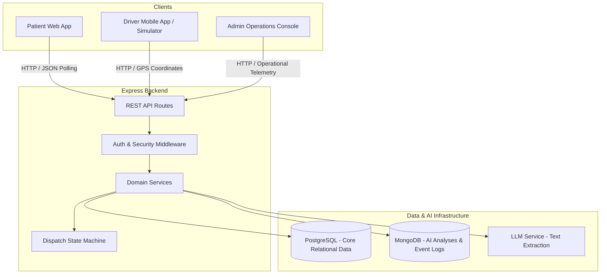

# ResQLink System Architecture & System Design

## 1. Executive Summary
**ResQLink** is a production-grade full-stack emergency ambulance availability and dispatch network. It bridges emergency patients with nearby on-duty ambulances using real-time GPS coordinates, AI-powered non-diagnostic emergency text extraction, and an operational dispatch console.

---

## 2. High-Level Architecture Diagram

---

## 3. Communication Strategy: Polling vs. WebSockets

### Prototype Choice: High-Efficiency HTTP Polling
- **Interval**: Configurable polling loop (`POLL_INTERVAL_MS=3000`).
- **Rationale**: Demonstrates deterministic REST API interactions, simple horizontal scaling without persistent socket state management, and robust error recovery across network dropouts.

### Production Roadmap: WebSockets & Server-Sent Events (SSE)
- In production, real-time telemetry will utilize Socket.io or SSE for push notifications (`ambulance_location_changed`, `request_accepted`) to eliminate polling overhead.

---

## 4. Security Infrastructure
1. **Password Hashing**: Bcryptjs with 10 salt rounds.
2. **Stateless Auth**: JWT (JSON Web Tokens) with Bearer scheme.
3. **Role Authorization**: Granular middleware restricting endpoints based on roles (`PATIENT`, `DRIVER`, `ADMIN`).
4. **LLM Protection**: Server-side proxy shielding API keys from client exposure.
